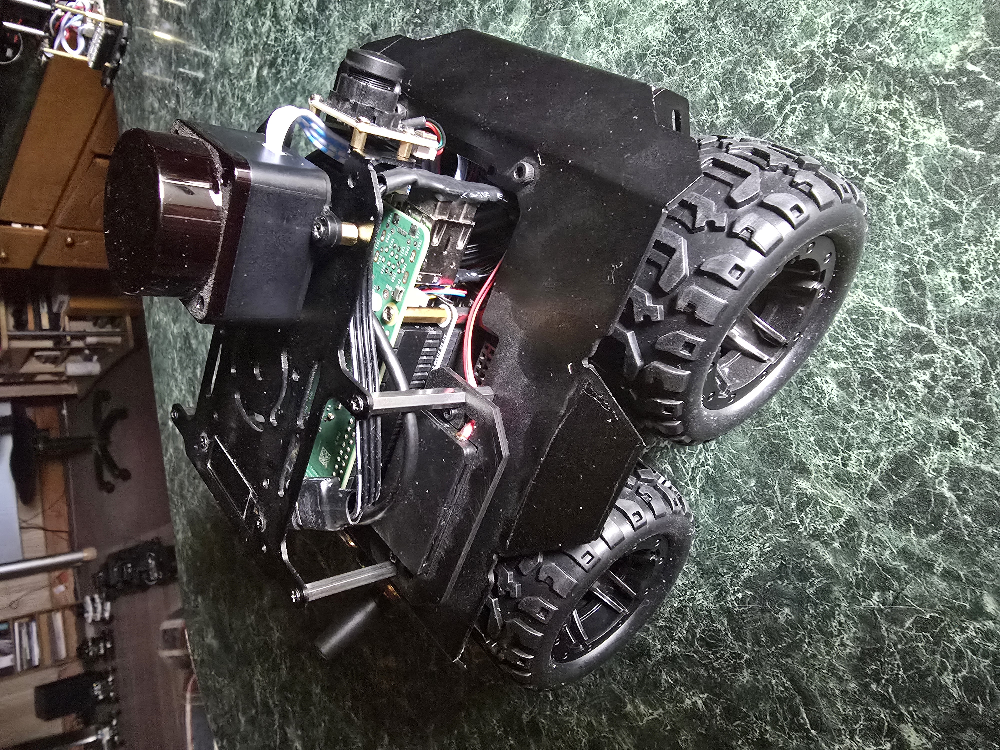

# Don's Rasprover

ROS2 Jazzy workspace for my Waveshare Rasprover robot.



## Packages

- **rasprover_msgs**: Custom messages and services (UpdateOLED service)
- **rasprover_bringup**: Core robot nodes (ESP32 bridge with OLED service, teleop)
- **rasprover_controller**: Encoder odometry and motion control
- **rasprover_description**: URDF models and STL meshes
- **rasprover_utils**: Battery monitor (INA219), OLED display client, safety stop
- **rasprover_tools**: Joystick and keyboard teleoperation

## Hardware

- Waveshare Rasprover chassis (4-wheel skid-steer)
- Raspberry Pi 5
- ESP32 motor controller (UART communication)
- LD19 LIDAR
- INA219 battery monitor (I2C)
- OLED display (via ESP32)
- IMU (via ESP32)

## Dependencies

### Third-party ROS2 Packages
```bash
cd ~/rasprover_ws/src
git clone https://github.com/ldrobotSensorTeam/ldlidar_stl_ros2.git
```

### System Dependencies
```bash
sudo apt install ros-jazzy-twist-mux python3-smbus espeak
```

## Build
```bash
cd ~/rasprover_ws
colcon build
source install/setup.bash
```

## Usage

Launch the robot base system:
```bash
ros2 launch rasprover_bringup robot_base.launch.py
```

Launch with joystick control:
```bash
ros2 launch rasprover_controller joy_teleop.launch.py
```

## Architecture

The system uses a service-based architecture for OLED updates:
- **ESP32 Bridge** (server): Owns serial port, provides `/update_oled` service
- **OLED Display** (client): Calls service to update display with status info
- **Battery Monitor**: Reads INA219 via I2C, provides audio warnings via espeak
